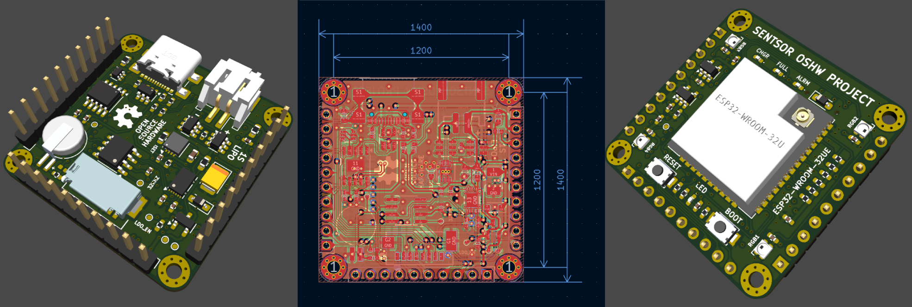

# Learn KiCad Through a ESP32-micro Compact PCB Design Project

This repository is a learning resource to explore **PCB design with KiCad** through a practical project: a compact and powerful ESP32-based board.  
The reference for this project comes from [Sentsor Core ESP32-Micro](https://oshwlab.com/sentsor-project/sentsor-core-esp32-micro).

---

## Project Image

---

## Description

- **Super compact & powerful**, measured only 35.56x35.56mm (1400x1400mil) with 3x10P standard pitch 2.54mm (100mil) pinout, packing all the onboard features.  
- **ESP32-WROOM-32UE**, comes with latest ECO V3 Dual Core 32-bit LX6 microprocessor with clock up to 240MHz, ULP co-processor, 520kB SRAM, 16MB flash.  
- **802.11b/g/n WiFi Connectivity**, support mode STA/AP/STA+AP mode with external antenna using U.FL/IPEX connector allowing the board to be installed inside the enclosure without worrying transceiver signal quality.  
- **Bluetooth 4.2 Connectivity**, support classic bluetooth and Low Energy (LE) protocol.  
- **CP2104 UART to USB Bridge**, full-speed programmer & data port with auto-reset trigger using DTR and RTS line.  
- **DS3231M RTC**, extremely accurate ±5ppm RTC with alarm trigger capability and onboard MS621FE rechargeable backup battery. Connected via I2C at address 0x68.  
- **Battery Powered**, run SENTSOR board everywhere without power supply issue with 1-cell Lithium Ion/Polymer battery via JST-PH connector.  
- **CN3165 Battery Charger**, solar-powered and USB-compatible Lithium Ion/Polymer charger with on-chip adaptive charging current for wide range of input power scenario.  
- **DW01A Battery Protection**, battery usage protection against over-charge, over-discharge, over-current, and short circuit.  
- **BQ27441-G1 Battery Fuel Gauge**, accurately monitor your battery Relative State of Charge (RSOC).  
- **RT9078 & RT9013 LDO**, dual low quiescent current LDO design providing configurable +3.3V power rail up to 800mA.  
- **Super Low Power**, measured sleep mode power consumption down to XuW (XuA XV at VBAT pin, LDO2 off).  
- **Built-in LED/RGB**, single color active-low LED connected to pin IO2, and 4xSK6812 addressable RGB LED connected to pin IO4. SK6812 data out is exposed so you can chain it up with the rest of the LED circuit.  
- **MicroSD socket**, connected via SPI with slave select (SS) at pin IO5.  
- **22 pin GPIO** @3V3 level, 3xUART, 2xSPI, 2xI2C, 2xI2S, 12bit ADC, 8bit DAC, hall-effect sensing, capacitive sensing, JTAG debug, etc.  
  Please see pinout poster/schematic file for more information.  

---
